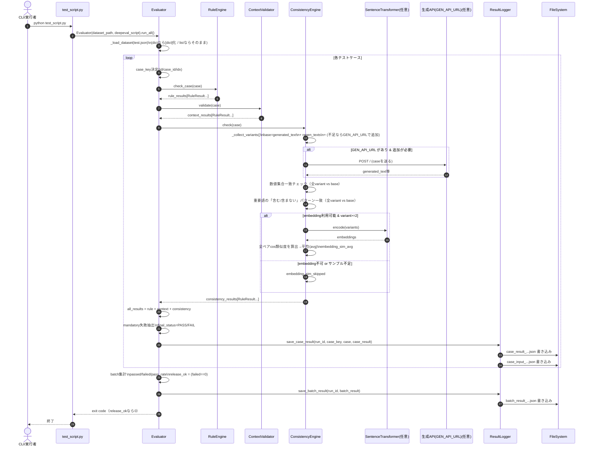
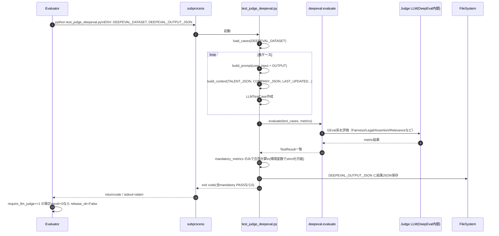

```mermaid
sequenceDiagram
    autonumber
    actor CLI as CLI/実行者
    participant TS as test_script.py
    participant EV as Evaluator
    participant RE as RuleEngine
    participant CV as ContextValidator
    participant CE as ConsistencyEngine
    participant EMB as SentenceTransformer(任意)
    participant GEN as 生成API(GEN_API_URL)(任意)
    participant RL as ResultLogger
    participant FS as FileSystem

    CLI->>TS: python test_script.py
    TS->>EV: Evaluator(dataset_path, deepeval_script).run_all()

    EV->>EV: _load_dataset(test.json)\n(dictなら[dict]化 / listならそのまま)

    loop 各テストケース
        EV->>EV: case_key決定(id/case_id/idx)
        EV->>RE: check_case(case)
        RE-->>EV: rule_results[RuleResult...]

        EV->>CV: validate(case)
        CV-->>EV: context_results[RuleResult...]

        EV->>CE: check(case)

        CE->>CE: _collect_variants()\nbase=generated_text\n+ regen_texts\n+ (不足ならGEN_API_URLで追加)
        alt GEN_API_URL があり & 追加が必要
            CE->>GEN: POST / (caseを送る)
            GEN-->>CE: generated_text等
        end

        CE->>CE: 数値集合一致チェック（全variant vs base）
        CE->>CE: 重要語の「含む/含まない」パターン一致（全variant vs base）

        alt embedding利用可能 & variant>=2
            CE->>EMB: encode(variants)
            EMB-->>CE: embeddings
            CE->>CE: 全ペアcos類似度を算出→平均(avg)\nembedding_sim_avg
        else embedding不可 or サンプル不足
            CE->>CE: embedding_sim_skipped
        end

        CE-->>EV: consistency_results[RuleResult...]

        EV->>EV: all_results = rule + context + consistency
        EV->>EV: mandatory失敗抽出\nfinal_status=PASS/FAIL
        EV->>RL: save_case_result(run_id, case_key, case, case_result)
        RL->>FS: case_result_...json 書き込み
        RL->>FS: case_input_...json 書き込み
    end

    EV->>EV: batch集計\npassed/failed/pass_rate\nrelease_ok = (failed==0)

    EV->>RL: save_batch_result(run_id, batch_result)
    RL->>FS: batch_result_...json 書き込み

    EV-->>TS: exit code（release_okなら0）
    TS-->>CLI: 終了
```

```mermaid
sequenceDiagram
    autonumber
    participant EV as Evaluator
    participant OS as subprocess
    participant DJ as test_judge_deepeval.py
    participant DE as deepeval.evaluate
    participant JLLM as Judge LLM(DeepEval内部)
    participant FS as FileSystem

    EV->>OS: python test_judge_deepeval.py\nENV: DEEPEVAL_DATASET, DEEPEVAL_OUTPUT_JSON
    OS->>DJ: 起動

    DJ->>DJ: load_cases(DEEPEVAL_DATASET)
    loop 各ケース
        DJ->>DJ: build_prompt(user_input + OUTPUT)
        DJ->>DJ: build_context(TALENT_JSON, COMPANY_JSON, LAST_UPDATED...)
        DJ->>DJ: LLMTestCase作成
    end

    DJ->>DE: evaluate(test_cases, metrics)
    DE->>JLLM: GEval系を評価（Fairness/Legal/Assertion/Relevanceなど）
    JLLM-->>DE: metric結果
    DE-->>DJ: TestResult一覧

    DJ->>DJ: mandatory_metrics のみで合否計算\n(環境変数でstrict化可能)
    DJ->>FS: DEEPEVAL_OUTPUT_JSON に結果JSON保存
    DJ-->>OS: exit code(全mandatory PASSなら0)
    OS-->>EV: returncode / stdout+stderr

    EV->>EV: require_llm_judge==1 の場合\nexit!=0なら release_ok=False
```